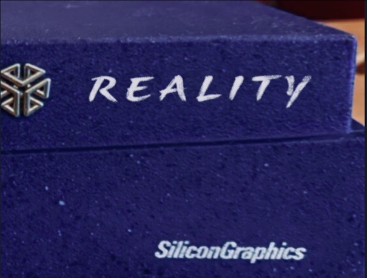

# SGI Reality

### This project will create a retro-modern FPGA-based SGI workstation based on Robert Peip's [N64_MiSTer](https://github.com/MiSTer-devel/N64_MiSTer) work, with hardware capabilities similar to the N64 but running IRIX.

The name 'Reality' was chosen as it alludes to SGI's 'Project Reality' code name for their N64 work, as well as SGI's Reality Engine and Infinite Reality systems.  And unlike emulation, it brings SGI hardware back to *reality*.

Other work to lean on will be SGI emulation from [MAME](https://github.com/mamedev/mame/tree/master/src/mame/sgi) and [IRIS](https://github.com/techomancer/iris) projects, and the GL rasterizer from the [Alice4](https://lkesteloot.github.io/alice/alice4/) and [sgi-demos](https://github.com/sgi-demos) projects.

## Project Plan

### Goal: Build N64's soul (R4300i CPU, RSP/RDP graphics) with Indy's skeleton (MC / HPC3 / serial / SCSI)

### Design constraints

- **Minimal departures from N64 hardware.** Known-necessary departures, stated up front:
  - **RAM:** 64–128 MB unified memory instead of 4–8 MB RDRAM (IRIX minimums).
  - **CPU identity:** COP0 PRId reports R4600 (IRIX has no R4300 entry in its CPU tables;
    cache-op semantics of R4300/R4600 are close — both primary-cache-only).
  - **Serial console:** Z8530 (Z85C30) UART at Indy addresses, for PROM/kernel console.
  - **Block storage:** WD33C93 SCSI register facade, with actual block I/O bridged to the
    MiSTer HPS (ARM/Linux) side, ao486-IDE style. Backed by SD card.
  - **Deleted:** PIF, cartridge bus, controller ports.
- **Graphics are RCP-only.** No Newport, no GR2. RSP + RDP are the machine's native graphics.
- **Memory map:** N64 RDRAM at 0x0 coincides with where IRIX expects RAM. RCP registers stay
  at 0x0400_0000–0x04FF_FFFF (IRIX doesn't claim that region). MC / HPC3 / peripherals are
  added at their Indy physical addresses (0x1FA0_0000, 0x1FB8_0000, ...).
- **Development platform:** DE10-Nano / MiSTer. If Cyclone V capacity becomes the binding
  constraint, escape hatch is a larger open Artix-7 / Kintex board; the RTL stays portable.

### Reference implementations (oracles)

- **MAME** `src/mame/sgi` — IP24 (Indy) driver is executable documentation for MC/HPC3
  register behavior; co-simulation diff target for chipset shims.
- **IRIS** (techomancer) — Indigo-family emulator; second independent SGI reference.
- **ares** — accuracy-reference N64 emulator; oracle for CPU/RCP behavior.
- **n64-systemtest** — hardware-validated CPU/RCP test suite; baseline before our own tests.
- **Alice4 / sgi-demos `libgl`** — IRIS GL implementation with swappable rasterizer
  backends; the software reference rasterizer is the golden image source for RDP output.

### Phase 0 — Toolchain (zero hardware)

Verilator build of the N64 core as a C++ simulation; libdragon as the MIPS cross-toolchain
(gcc for R4300i, linker scripts, ROM packaging for free). Prove the pipeline by running
existing known-good ROMs (libdragon examples, n64-systemtest) in simulation, with output via
the ISViewer debug channel and framebuffer dumps to PNG.

**Exit criterion:** build core → load ROM → run N cycles → observe correct output, entirely
in simulation.

### Phase 1 — The probe: TLB / exception torture ROM

A bare-metal C + inline-asm ROM exercising what IRIX needs and games never touch:

1. `tlbwi`/`tlbr` round-trip through all 32 entries (EntryHi/EntryLo exactness)
2. `tlbp` probe hits and misses (P bit)
3. Deliberate TLB refill exception: unmapped access → refill vector → verify
   BadVAddr/Context → write entry in handler → eret → access completes
4. TLB Mod (dirty-bit) exception on write to read-only page (copy-on-write path)
5. ASID isolation: same VA, two ASIDs, distinct PAs; switch and verify (context switching)
6. Wired entries; paired even/odd page semantics

Each test reports PASS/FAIL over the debug channel.

**Reading the result:**
- *Green:* foundation solid → buy hardware, proceed.
- *Yellow (refill/Mod/ASID failures):* expected; find/fix bugs in the core with
  MAME/ares as oracle. Doubles as FPGA apprenticeship + upstream contribution.
- *Red (basics broken / sim unbuildable):* major information, cheaply bought — reassess.

### Phase 2 — GL-first: IRIS GL on the RDP (no IRIX yet)

Port sgi-demos `libgl` with a new **RDP backend** (third backend beside the software
reference rasterizer and `ogl_rasterizer.c`): emit RDP triangle/span commands instead of
walking spans in software. CPU does transform/clip initially (as Indigo LG1 did); RSP
microcode transforms come later as an optimization.

Runs bare-metal (or Linux-hosted) on the core — no kernel driver needed. The 15-demo
sgi-demos corpus is the conformance suite; the software rasterizer is the golden reference;
the existing pixel-variance smoke-test harness retargets to diff RDP output against it.

**Exit criterion:** `buttonfly` (or peers) rendering via RDP, pixel-diffed against the
software rasterizer.

**This is the early dopamine milestone — an SGI demo on N64 silicon, months not years in.**

### Phase 3 — Indy skeleton grafts

MC memory controller, HPC3, Z8530, SCSI facade as new RTL modules, validated by
co-simulation against MAME's IP24 driver (same register pokes, diff the behavior).
PRId lie. PIF/cartridge deletion. Capacity check on Cyclone V; migrate boards if needed.

**Exit criterion:** Indy PROM (or a minimal ARCS-faking bootloader) runs and reaches a
serial console prompt on the core.

Note: real PROM is the romantic path and a brutal test of shim fidelity; a minimal ARCS
firmware fake is months faster. Decide when we get here.

### Phase 4 — IRIX boots

Kernel loads from SCSI(SD), probes MC/HPC3, mounts root, reaches single-user then
multi-user over serial console. Expect the long tail here: TLB/cache edge cases,
interrupt topology, timer behavior. Co-simulation and kernel-source spelunking
(NetBSD/Linux sgimips as auxiliary references) are the tools.

**Exit criterion:** `IRIX Release 6.2 IP24 reality` login over serial. Hostname is
non-negotiable.

### Phase 5 — Graphics under IRIX

Escalating levels, each independently useful:

1. **Userspace RCP access:** mmap physical RCP registers from an IRIX process; run the
   Phase 2 `libgl`+RDP stack under IRIX with no kernel driver.
2. **Kernel gfx driver as dumb framebuffer:** textport and X11 on RCP video output.
   (Hardest software in the project; IRIX gfx subsystem is undocumented — Newport driver
   RE + IP24 kernel symbols light the way. Optional for a long time thanks to level 1.)
3. **GL subset on RSP microcode:** transforms on RSP, spans on RDP — the blocks doing
   the jobs they were born for. The trophy milestone.

### Phase 6 — The box

Navy body (O2 lineage), jungle-green / translucent accent (console lineage), SGI-style
badge: **Reality**. 3D-printed enclosure around the board. `hostname reality`.

## Working practices

- Fork tracks upstream (`upstream` remote, periodic merges) until RTL genuinely diverges.
- Probe/test work lives in its own directory (`reality/`), core RTL untouched for as long
  as possible.
- Co-simulation diffing (Verilator model vs MAME on identical stimuli) as standard debugging
  practice — cheapest way to localize ASIC-behavior mistakes.
- Every phase has a demoable exit criterion; the project survives on visible wins.

## Credits & license

To be built on **N64_MiSTer** by **Robert Peip (FPGAzumSpass)** — the R4300i, RSP, and RDP
implementations that make this thinkable. This fork inherits the upstream license
(verify and state exact license here before divergence).

Reference IRIS GL rasterizer: **Alice4** and **sgi-demos**.
Reference emulation: **MAME** SGI drivers, **IRIS** (techomancer), **ares**.

## Upstream N64_MiSTer notes

### Hardware Requirements
SDRAM of any size is required.
32Mbyte SDRAM can only be used for games up to 16Mbyte in size.

### Bios
Rename your PIF ROM file (e.g. `pif.ntsc.rom` ) and place it in the `./games/N64/` folder as `boot.rom`

### Error messages

If there is a recognized problem, an overlay is displayed, showing which error has occured.
Errors are hex encoded by bits, so the error code can represent more than 1 error.

List of Errors:
- Bit 0 - Memory access to unmapped area
- Bit 1 - CPU Instruction not implemented, currently used for cache command only
- Bit 2 - CPU stall timeout
- Bit 3 - DDR3 timeout
- Bit 4 - FPU internal exception
- Bit 5 - PI error
- Bit 6 - critical Exception occurred (heuristic, typically games crash when that happens, but can be false positive)
- Bit 7 - PIF used up all 64 bytes for external communication or EEPROM command have unusual length
- Bit 8 - RSP Instruction not implemented
- Bit 9 - RSP stall timeout
- Bit 10 - RDP command not implemented
- Bit 11 - RDP combine mode not implemented
- Bit 12 - RDP combine alpha functionality not implemented
- Bit 13 - SDRAM Mux timeout
- Bit 14 - not implemented texture mode is used
- Bit 15 - not implemented render mode (2 pass or copy) is used
- Bit 16 - RSP read Fifo overflow
- Bit 17 - DDR3 - RSP write Fifo overflow
- Bit 18 - RSP IMEM/DMEM write/read address collision detected
- Bit 19 - One fo the DDR3 requesters wants to write or read outside of RDRAM
- Bit 20 - RSP DMA wants to write outside of RDRAM
- Bit 21 - RDP pixel writeback wants to write outside of RDRAM
- Bit 22 - RDP Z writeback wants to write outside of RDRAM
- Bit 23 - RSP PC is modified by register access while RSP runs
- Bit 24 - VI line processing wasn't able to complete in time
- Bit 25 - RDP Mux missed request
- Bit 26 - CPU Writefifo full (should never happen, internal CPU logic bug)
- Bit 27 - TLB access from multiple sources in parallel (should never happen, internal CPU logic bug)
- Bit 28 - PI DMA wants to write outside of RDRAM*
